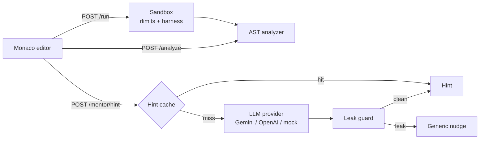

<div align="center">

# Runedact

**Practice DSA out loud — get hints, never answers.**

Run your Python in a resource-limited sandbox, see what your code *actually* does,
and ask a mentor that refuses to hand you the solution.

[](https://github.com/rajdeep-3305/Runedact/actions/workflows/ci.yml)


</div>

---

## Why

LeetCode-style grind has a failure mode: you get stuck, you open the editorial,
you *understand* it, and two days later you can't reproduce it. Runedact tries to
break that loop. The AI mentor is allowed to nudge — ask about your loop invariant,
point at the failing hidden test — but a regex guard intercepts any response that
smells like a complete solution, and the app records whether a leak even happened.

## What's inside

| | |
|---|---|
| 🧯 **Sandbox** | Submissions run in a subprocess under `setrlimit` — 2s CPU, 64MB address space, 1 process. Fork bombs and `while True:` both die quietly. |
| 🔍 **AST analysis** | Python's `ast` module walks your code for nested loops, unmemoized recursion, and `list.index()`-in-a-loop style traps, then estimates big-O. |
| 💡 **Leveled hints** | Three levels, from "what data structure fits?" to "look at line 7". The learner picks how much help to get. |
| 🛡️ **Leak guard** | Regex heuristics catch fenced code blocks, function/class definitions, and "here is the complete solution" phrasing before the hint reaches you. |
| ⚡ **Hint cache** | Same problem + same level + same analyzer verdict = same hint, served from memory. No second LLM bill. |
| 📊 **Eval harness** | Seven buggy submissions covering classic DSA mistakes; local metrics score leak rate, quality, and relevance. No judge API needed. |

## Architecture



## Quick start

```bash
git clone https://github.com/rajdeep-3305/Runedact.git
cd Runedact

# backend
python3 -m venv .venv
.venv/bin/pip install -r backend/requirements.txt

# frontend
cd frontend && npm install && npm run build && cd ..

./start.sh
```

Open **http://localhost:8000** — FastAPI serves the built React bundle, so one
process runs the whole thing. No API keys needed out of the box: without
credentials the mentor falls back to a deterministic mock provider, so clone → run → works.

Prefer containers? `docker compose up --build`.

## API

| Method | Route | What it does |
|---|---|---|
| `GET` | `/api/v1/problems` | List problems |
| `GET` | `/api/v1/problems/{id}` | Statement, starter code, visible tests |
| `POST` | `/api/v1/run` | Execute code in the sandbox |
| `POST` | `/api/v1/analyze` | AST-only analysis, no execution |
| `POST` | `/api/v1/mentor/hint` | Leveled hint for the current code |
| `POST` | `/api/v1/evals/run` | Run the benchmark |
| `GET` | `/api/v1/evals/history` | Past benchmark runs |

## Hint levels

| Level | Intent | Example shape |
|---|---|---|
| **L1 — Concept** | Don't name the algorithm yet | *"What does your state look like after each step?"* |
| **L2 — Algorithmic** | Point at the invariant / structure | *"If `target - n` was already seen, what's the lookup cost?"* |
| **L3 — Targeted** | Name the flaw, never the fix | *"Your inner loop re-scans instead of consulting `seen`."* |

## Sandbox limits

| Resource | Limit | Mechanism |
|---|---|---|
| CPU | 2s | `RLIMIT_CPU` + wall-clock `communicate(timeout=2.5)` |
| Memory | 64MB | `RLIMIT_AS` |
| Processes | 1 | `RLIMIT_NPROC` |

Honest limitation: this constrains resources, not the filesystem or network.
Container-level isolation (or nsjail) is the next step for a real multi-tenant deployment.

## Evals

```bash
.venv/bin/python backend/run_evals.py
```

Scores generated hints across `backend/app/evals/dataset.json` — one case per bug
category (nested-loop brute force, duplicate index collision, bracket counter,
stack underflow, greedy failure, unmemoized recursion, pointer stagnation).
Leak rate is the headline metric; target is 0%.

## Tests

```bash
.venv/bin/pytest backend/tests/ -v
```

## Roadmap

- [ ] Isolate submissions in containers instead of `setrlimit`-only
- [ ] Stream hints token-by-token with the leak guard inspecting chunks
- [ ] Per-user history: replay your wrong submissions a week later
- [ ] More problems beyond the first three

## License

MIT — see [LICENSE](LICENSE).
