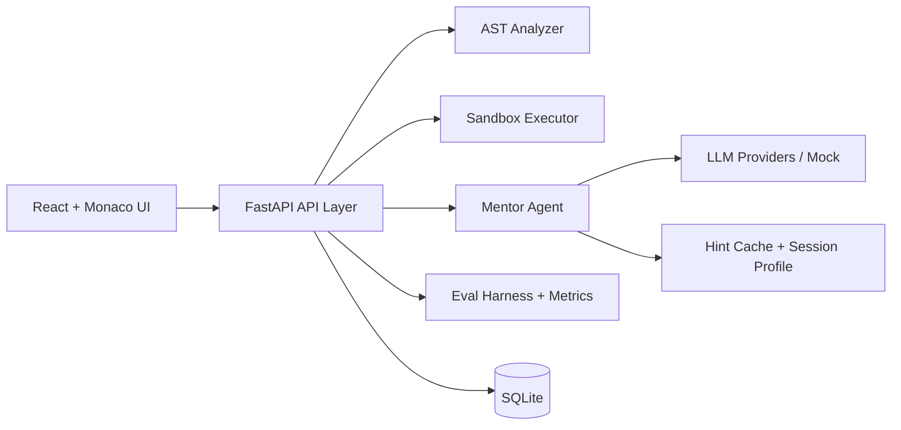

<p align="center">
  
</p>

Runedact is an AI-assisted coding tutor with safe hinting and measurable quality.

Practice DSA out loud — get hints, never answers.

You write Python in the browser, it runs in a sandboxed subprocess with CPU
and memory limits, and the mentor gives you hints without handing over the
solution. No API keys required — the mentor falls back to a mock provider
that keyword-matches common bug patterns.

## What's in here

The sandbox can run in two modes:

- `process` (default): subprocess + `setrlimit` (2s CPU, 64MB RAM, 1 process)
- `docker`: containerized execution (`--read-only`, optional `--network none`,
  memory and pid limits) for stronger isolation

Your code is temp-filed, executed, and torn down before you get the results back.

The AST analyzer walks your code with Python's stdlib `ast` module and flags
the usual suspects: nested loops, unmemoized recursion, `list.index()` inside
loops, that kind of thing. It also estimates big-O so the mentor prompt has
some context.

Hints come in 3 levels. Level 1 is a conceptual nudge, level 2 points at the
right data structure or invariant, level 3 is more targeted. You pick how
much help you want. Everything the LLM says goes through a leak guard first —
regex checks for code blocks, function/class defs, and phrases like "here is
the complete solution." If it trips, you get a generic fallback instead.

The hint cache is keyed on problem + hint level + analyzer verdict.
Same situation = same hint from memory, no second LLM call.

There is also lightweight learner session memory (in-memory): repeated
failures/anti-patterns can automatically nudge hinting to a more targeted level.

There's also a read-only LeetCode browser backed by their GraphQL API.
Imported problems run against the statement's example blocks only — not their
hidden test cases, which aren't public. That's by design.

## How it actually works

1. Your code + a test harness is written to a temp file and run as a
   subprocess. `preexec_fn` applies the rlimits before exec.
2. The AST walker checks for complexity smells.
3. Hint cache is checked — if it's a hit, we skip the LLM entirely.
4. On a miss, the LLM (Gemini/OpenAI, or mock fallback) gets a structured
   prompt with your code, AST metrics, and what the sandbox found.
5. Every LLM response goes through the leak guard before you see it.

## Architecture (high level)


```mermaid
flowchart LR
  UI[React + Monaco UI] --> API[FastAPI API Layer]
  API --> AST[AST Analyzer]
  API --> SB[Sandbox Executor]
  API --> MA[Mentor Agent]
  MA --> LLM[LLM Providers / Mock]
  MA --> HC[Hint Cache + Session Profile]
  API --> EV[Eval Harness + Metrics]
  API --> DB[(SQLite)]
```

## Getting it running

```bash
git clone https://github.com/rajdeep-3305/Runedact.git
cd Runedact
python3 -m venv .venv
.venv/bin/pip install -r backend/requirements.txt
cd frontend && npm install && npm run build && cd ..
./start.sh
```

Then open http://localhost:8000.

You can also use the Makefile targets: `make install`, `make run`, `make dev`,
`make test`, `make lint`.

## API endpoints

- `GET  /api/v1/problems` — list problems
- `GET  /api/v1/problems/{id}` — full statement + starter code
- `POST /api/v1/run` — execute in sandbox
- `POST /api/v1/analyze` — AST only, no execution
- `POST /api/v1/mentor/hint` — get a leveled hint
- `POST /api/v1/evals/run` — run the eval benchmark
- `GET  /api/v1/evals/history` — past benchmark runs

## Sandbox limits

- CPU: 2s
- Memory: 64MB
- Processes: 1
- Docker mode can enforce read-only FS and no network.

### Threat model snapshot

Protected:
- resource abuse (CPU/RAM/process count)
- accidental answer leakage via guard rules

Not fully protected:
- kernel/container escape class risks (when host Docker is used)
- sophisticated prompt injection/jailbreak attempts that bypass regex heuristics
- long-term profile persistence (session memory is currently in-memory only)

## Eval dataset

`backend/app/evals/dataset.json` has 7 buggy submissions covering the mistakes
you actually make: nested-loop brute force, duplicate index collision, counting
brackets instead of a stack, popping an empty stack, greedy failure, unmemoized
recursion, and infinite loop from a stuck pointer. The harness scores hints with
simple string matching — no external judge API.

## Known issues

- LeetCode import only works for problems with plain literal examples (no linked
  lists, trees, or graphs). The HTML parsing is fragile on premium problems.
- Hint cache/session profiles are in-memory only — restarts lose them.
- Mock hints only cover 4 problem types. Most bugs get a generic fallback.
- No user accounts yet.

## Quality and observability

- Eval metrics: leak rate, concept coverage, invariant coverage, quality score,
  helpfulness, and latency.
- `GET /api/v1/evals/history` exposes recent trend summaries.
- `GET /api/v1/ops/metrics` exposes request/sandbox counters and avg latency.
- API returns `X-Request-ID` and `X-Response-Time-Ms` for debugging.

## Security / production toggles

Set in `.env`:
- `API_AUTH_ENABLED=true` + `API_KEY=...` for API key auth
- `RATE_LIMIT_PER_MINUTE=...` for per-path/IP throttling
- `CORS_ORIGINS=[...]` for stricter browser origin control
- `SANDBOX_MODE=process|docker` and `SANDBOX_DISABLE_NETWORK=true`

## Interview story starter (60s)

“I built Runedact, an AI coding mentor that gives progressive hints instead of
full answers. It executes code in a restricted sandbox, analyzes AST signals,
and runs leak-guard checks before returning hints. I treated it like an AI
product, so I added offline evaluation (leak rate, concept/invariant coverage,
helpfulness, latency) and trend tracking. I also added request-level
observability and optional hardening controls (API key auth, rate limiting,
stricter CORS, docker-based isolation mode). The core tradeoff is safety vs
latency and depth vs simplicity.”

## License

MIT.
